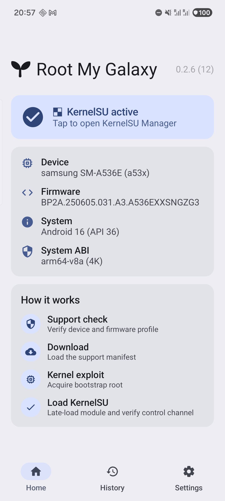
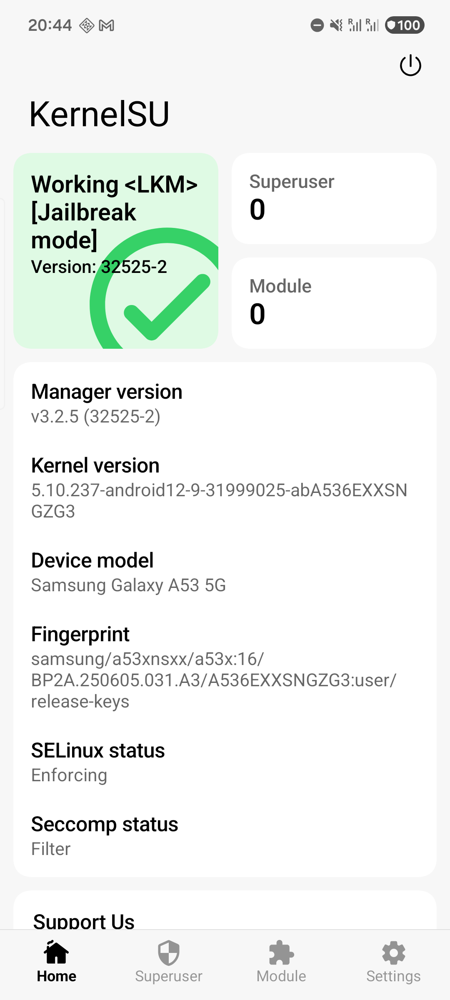

# SM-A536E A536EXXSNGZG3 validation

This profile was validated on a Galaxy A53 5G running the exact firmware and
kernel below.

| Field | Value |
| --- | --- |
| Model | `SM-A536E` |
| Device | `a53x` |
| Firmware | `A536EXXSNGZG3` |
| Android | 16 / API 36 |
| Page size | 4096 |
| Kernel | `5.10.237-android12-9-31999025-abA536EXXSNGZG3` |

The payload ran from the normal application domain
(`u:r:untrusted_app:s0`), found the KASLR slide with the CPU0-pinned prefetch
channel, found and reclaimed the target page with KernelSnitch, established
kernel read/write, and reached `ROOT_OK`. The runtime path uses neither
tracefs nor `perf_event_open`.

The exact KernelSU module was late-loaded on the same boot. KernelSU Manager
reported `Working <LKM> [Jailbreak mode]`, version `32525-2`.

## Device evidence

| Root My Galaxy | KernelSU Manager |
| --- | --- |
|  |  |

## Published artifacts

| Artifact | Bytes | SHA-256 |
| --- | ---: | --- |
| `artifacts/a53x-A536EXXSNGZG3/cve-2026-43499-app.so` | 196608 | `27e792c5576261a265fc4477f06fa87ae6d83093ed2c5f1a7bec5536ba06f8ba` |
| `kernelsu/android12-5.10_kernelsu-A536EXXSNGZG3-kdp.ko` | 341368 | `ae9d3815c69d708063a77c49470357f2b5b45ba7313cde6cebbf32ae05fa17a8` |
| `kernelsu/ksud-A536EXXSNGZG3-kdp` | 4870752 | `c35130bf54f7b8e3c31eee2349c7e053d1e2878b4d47b21090012523ff02e3ef` |

The module has exact vermagic:

```text
5.10.237-android12-9-31999025-abA536EXXSNGZG3 SMP preempt mod_unload modversions aarch64
```

The result is a volatile LKM installation. A reboot removes KernelSU and the
bootstrap/late-load process must be run again. No boot image was flashed.

This profile is exact-build support; it does not claim compatibility with
other Galaxy A53 models, firmware, or kernel releases.
